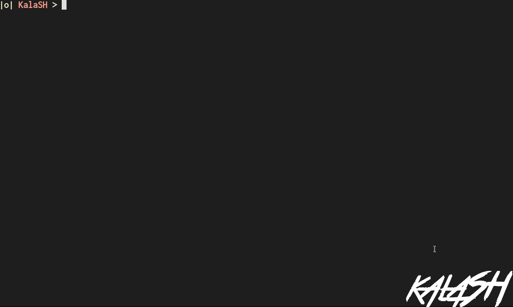
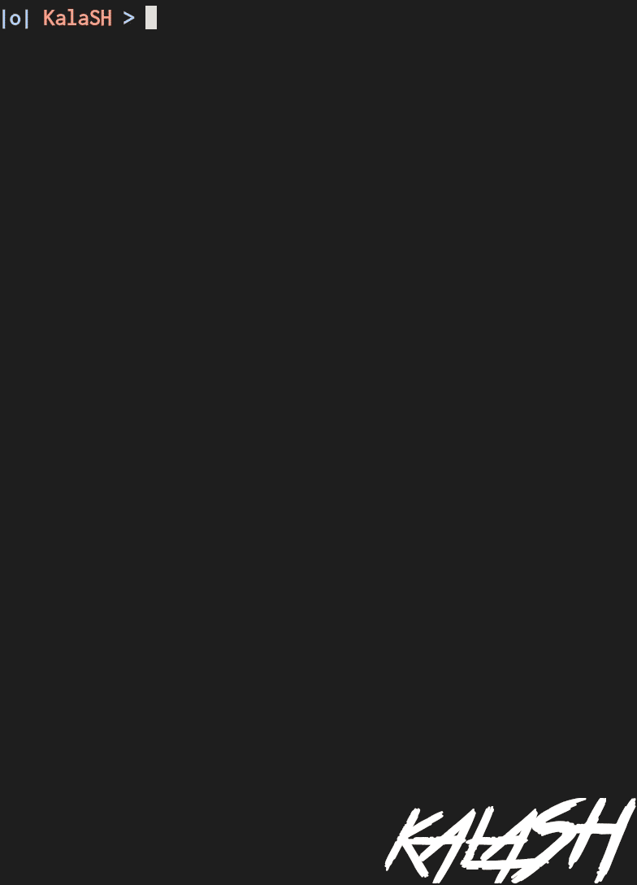
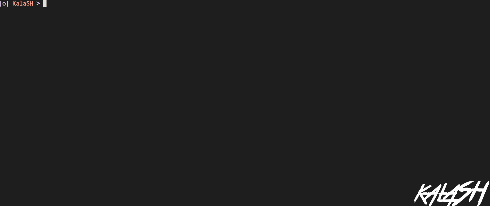
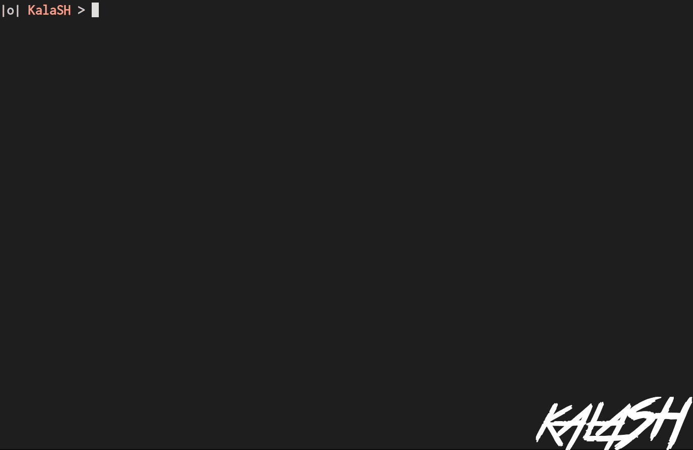
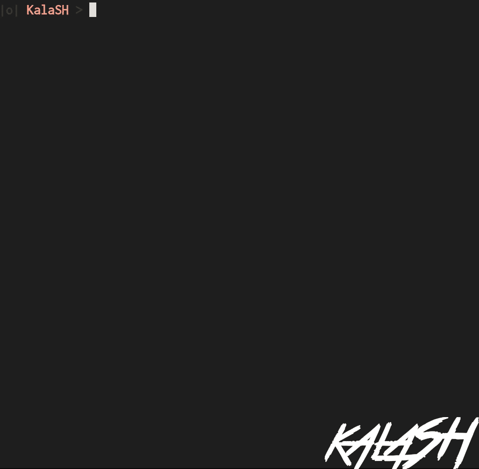
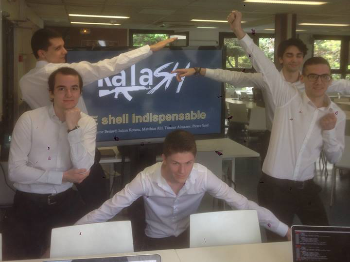

# 42sh

42sh is the last (and biggest) project of Epitech's first year. We had to recreate a tcsh-like shell in C. We chosed to call ours kalaSH.

## Features

### Classical features

+ Command execution.
+ Echo, env, setenv, unsetenv and cd builtins.
+ Multi-pipes.
+ && and ||

### Advanced aliases (with alias loop detection)

### Up/Down arrows history + Save file

### Globbings

### Inhibitors

### Line edition and auto-completion

## Bonus

For our main bonus, we decided to create a user-friendly terminal.

Through a pty, this terminal can interact with any shell.

(gif looks very laggy, but the kalaTERM is not at all)

## Team

+ Guillaume **Benard**
+ Iulian **Rotaru**
+ Matthias **Alif**
+ Pierre **Said**
+ Timour **Almazov**

## Score

Keynote : **20**

